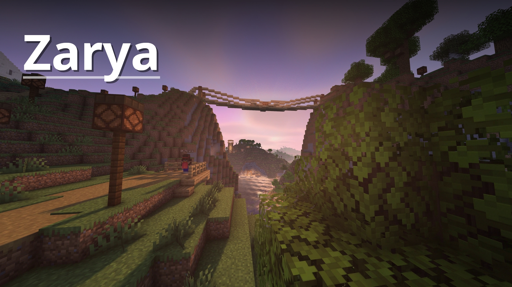

# Zarya

**Zarya** is a fork of [minecraft-miniature-shader](https://github.com/mateuskreuch/minecraft-miniature-shader) by Mateus A. Kreuch,
with a large visual extension layer added by **Throw New Error**.

### [Join the Discord](https://discord.gg/twzQGR3Mm8)

---

## What's new in Zarya

- **Realistic water** — custom wave geometry, refraction, reflections, underwater fog
- **Volumetric lighting** — god rays with weather and rain interaction
- **Atmospheric fog** — height fog, Mie-style scattering, Nether fog, weather blending
- **Procedural clouds** — three-layer cloud model (low / mid / upper), cloud shadows
- **Temporal anti-aliasing (TAA)** — Catmull-Rom history sampler, YCoCg color clipping
- **FXAA + sharpen** — fast edge AA with configurable sharpness recovery
- **SSAO** — screen-space ambient occlusion
- **Procedural normals** — generated from albedo at runtime, no resource pack needed
- **IPBR** — specular, emission and normals driven by image analysis
- **Procedural stars** — twinkle, color temperature, density control
- **Waving foliage** — leaves and tall plants with snow / rain amplitude modulation
- **Distant Horizons support** — LOD seam dithering, DH shadow pass, DH water

---

## Compatibility

- Iris 1.7+
- OptiFine (limited — DH and some Iris-only uniforms will not work)
- Minecraft 1.21+

---

## License

The base shader (`minecraft-miniature-shader`) is **MIT** licensed.
See [`LICENSE`](LICENSE) for the full text — Copyright (c) 2022 Mateus A. Kreuch.

**All new code added by the Zarya fork is All Rights Reserved.**
See [`TNE_LICENSE.md`](TNE_LICENSE.md) for the Zarya fork terms.
- You may use Zarya for personal play.
- You may not redistribute, repack, or publish modified versions of Zarya-specific code without explicit written permission from Throw New Error.
- You may not upload Zarya or its derivatives to Modrinth, CurseForge, or any other platform without permission.

Third-party code embedded in Zarya is listed in [`THIRD_PARTY_NOTICES.md`](THIRD_PARTY_NOTICES.md).

---

## Credits

| | |
|---|---|
| **Mateus A. Kreuch** | Original minecraft-miniature-shader (MIT) |
| **Throw New Error** | Zarya fork — All Rights Reserved |
| **David Hoskins** | Hash without Sine (MIT) — fog dithering, star field |
| **Simon Rodriguez / NVIDIA** | FXAA 3.11 compact (MIT + BSD-3-Clause) |
